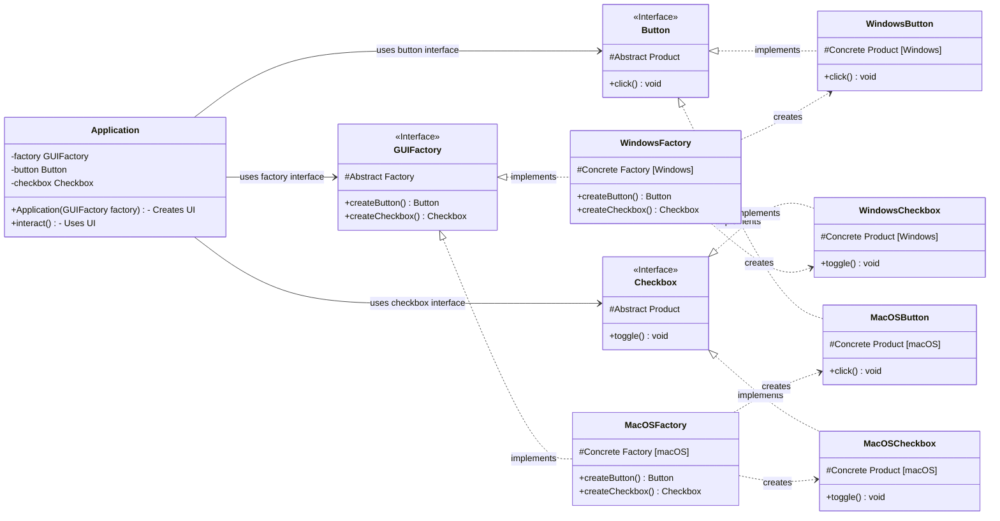

# Abstract Factory Pattern - Java Example

## 1. Introduction

This document analyzes the Java implementation of the Abstract Factory design pattern provided by Refactoring.Guru. The Abstract Factory pattern provides an interface for creating families of related or dependent objects without specifying their concrete classes. It's a creational pattern that helps ensure that the products created by a factory are compatible with each other.

The example demonstrates creating GUI elements (Buttons, Checkboxes) for different operating systems (Windows, macOS) using this pattern.

## 2. Problem

Imagine an application that needs to support multiple look-and-feel standards, like Windows and macOS. Creating UI elements directly within the application logic would lead to a messy codebase filled with `if/else` statements checking the current OS to instantiate the correct UI element class (e.g., `if (os == "Windows") new WindowsButton(); else new MacOSButton();`).

This approach has several drawbacks:
*   **Tight Coupling:** The client code is tightly coupled to the concrete UI element classes.
*   **Maintenance Nightmare:** Adding a new OS or a new type of UI element requires modifying code in many places.
*   **Inconsistency:** It's hard to guarantee that all UI elements created belong to the same OS family (e.g., accidentally creating a Windows button alongside a macOS checkbox).

## 3. Solution: Abstract Factory

The Abstract Factory pattern solves this by introducing layers of abstraction:

1.  **Abstract Product Interfaces:** Define interfaces for each distinct type of product (e.g., `Button`, `Checkbox`). These interfaces declare the common operations the products must perform (e.g., `click()/toggle()`).
2.  **Concrete Product Classes:** Implement the Abstract Product interfaces for each specific variant (e.g., `WindowsButton`, `MacOSButton`, `WindowsCheckbox`, `MacOSCheckbox`). Each concrete product provides the specific implementation for its variant (e.g., rendering a Windows-style button).
3.  **Abstract Factory Interface:** Declares a set of methods for creating *each* type of abstract product (e.g., `createButton()`, `createCheckbox()`). The return types of these methods are the *Abstract Product* interfaces.
4.  **Concrete Factory Classes:** Implement the Abstract Factory interface for each product family (e.g., `WindowsFactory`, `MacOSFactory`). Each concrete factory implements the creation methods to instantiate and return the corresponding *Concrete Products* for that family (e.g., `WindowsFactory.createButton()` returns a `WindowsButton`).
5.  **Client:** The client code works only with the Abstract Factory and Abstract Product interfaces. It receives a concrete factory object at runtime (often via dependency injection or configuration) but doesn't know its specific type. When the client needs a product, it calls the appropriate creation method on the factory interface. This ensures that the client gets products from the *same family* without being coupled to concrete classes.

## 4. Code Analysis

### Components:

*   **Abstract Products:**
    *   `buttons/Button.java`: Interface defining the `click()` method for all buttons.
    *   `checkboxes/Checkbox.java`: Interface defining the `toggle()` method for all checkboxes.
*   **Concrete Products:**
    *   `buttons/WindowsButton.java`: Implements `Button` for Windows look-and-feel.
    *   `buttons/MacOSButton.java`: Implements `Button` for macOS look-and-feel.
    *   `checkboxes/WindowsCheckbox.java`: Implements `Checkbox` for Windows look-and-feel.
    *   `checkboxes/MacOSCheckbox.java`: Implements `Checkbox` for macOS look-and-feel.
*   **Abstract Factory:**
    *   `factories/GUIFactory.java`: Interface declaring methods `createButton()` (returns `Button`) and `createCheckbox()` (returns `Checkbox`).
*   **Concrete Factories:**
    *   `factories/WindowsFactory.java`: Implements `GUIFactory`. `createButton()` returns `WindowsButton`, `createCheckbox()` returns `WindowsCheckbox`.
    *   `factories/MacOSFactory.java`: Implements `GUIFactory`. `createButton()` returns `MacOSButton`, `createCheckbox()` returns `MacOSCheckbox`.
*   **Client:**
    *   `Application.java`: Contains the business logic. It takes a `GUIFactory` in its constructor. It uses the factory to create `Button` and `Checkbox` objects and calls their `click()/toggle()` methods. The `Application` class doesn't know *which* concrete factory or products it's using; it only interacts with the interfaces.
*   **Configuration/Setup:**
    *   `Demo.java`: The entry point. It determines the desired OS (simulated via configuration or system properties), creates the *corresponding* concrete factory (`WindowsFactory` or `MacOSFactory`), injects this factory into a new `Application` instance, and then runs the application's logic (`click()/toggle()` method).

## 5. Class Diagram (Mermaid)

## 6. How it Works (Interaction Flow)

1.  **Configuration (`Demo.java`)**: The `Demo` class reads configuration (e.g., simulates checking the OS name).
2.  **Factory Instantiation (`Demo.java`)**: Based on the configuration, `Demo` instantiates a *concrete* factory (`WindowsFactory` or `MacOSFactory`).
3.  **Client Instantiation (`Demo.java`)**: `Demo` creates an instance of the `Application` class, passing the chosen concrete factory (typed as the `GUIFactory` interface) to its constructor.
4.  **Product Creation (`Application.java`)**: When the `Application` needs UI elements (e.g., in its constructor or a method like `createUI`), it calls the creation methods (`createButton()`, `createCheckbox()`) on the `GUIFactory` instance it holds.
5.  **Concrete Product Return**: The concrete factory (`WindowsFactory` or `MacOSFactory`) receives the call and instantiates the corresponding concrete products (`WindowsButton`/`WindowsCheckbox` or `MacOSButton`/`MacOSCheckbox`). These products are returned to the `Application`, typed as their respective interfaces (`Button`, `Checkbox`).
6.  **Product Usage (`Application.java`)**: The `Application` now holds references to the abstract products (`Button`, `Checkbox`) and can use them (e.g., call `button.click()`, `checkbox.toggle()`). The actual behavior (Windows or macOS) depends on the concrete products created by the factory chosen in step 2, but the `Application` code itself remains unchanged regardless of the OS family.

## 7. Benefits

*   **Isolation of Concrete Classes:** The client code works with interfaces, decoupling it from concrete product implementations.
*   **Easy Exchange of Product Families:** You can easily switch the entire family of products by changing the concrete factory instance passed to the client (e.g., switching from `WindowsFactory` to `MacOSFactory`).
*   **Ensures Product Compatibility:** Since a specific concrete factory creates all products for a family, it guarantees that the created objects are designed to work together (e.g., all UI elements follow the same OS look-and-feel).
*   **Single Responsibility Principle:** Product creation logic is encapsulated within the factories.
*   **Open/Closed Principle:** You can introduce new variants (families) of products (e.g., a `LinuxFactory` and corresponding `LinuxButton`, `LinuxCheckbox`) without modifying existing client code or abstract interfaces, only by adding new concrete factories and products.

## 8. Drawbacks

*   **Complexity:** Introduces several new interfaces and classes, increasing the overall codebase complexity.
*   **Difficult to Add New Product Types:** Adding a *new kind* of product (e.g., a `TextBox` interface) requires modifying the `GUIFactory` interface and *all* its concrete implementations (`WindowsFactory`, `MacOSFactory`), potentially violating the Open/Closed Principle in that dimension.

## 9. Conclusion

The Abstract Factory pattern, as demonstrated in the Refactoring.Guru example, is highly effective for managing the creation of related objects (families) without coupling client code to concrete classes. It promotes consistency within a product family and makes switching between families straightforward. While it adds complexity, the benefits in terms of flexibility, maintainability, and adherence to design principles often outweigh the costs in scenarios where multiple product families are needed.
