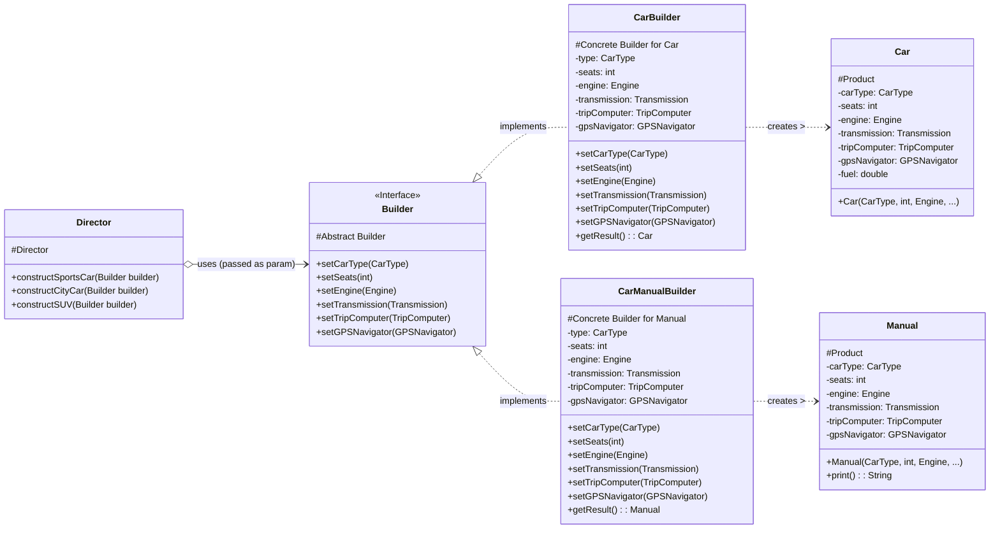

# Builder Design Pattern - Java Example

## 1. Introduction

This document analyzes the Java implementation of the Builder design pattern provided by Refactoring.Guru. The Builder pattern is a creational design pattern that lets you construct complex objects step by step. The pattern allows you to produce different types and representations of an object using the same construction code.

The example demonstrates building different types of `Car` / Car `Manual`s objects using this pattern.

## 2. Problem

Constructing complex objects can become cumbersome if the object requires many parameters in its constructor, especially if some are optional or depend on each other. This often leads to:

*   **Telescoping Constructors:** Multiple constructor overloads with varying parameter lists, making the class hard to read and maintain.
    ```java
    // Product(a); Product(a,b); Product(a,b,c); ...
    ```
*   **Inconsistent State:** If an object is created with a simple constructor and then configured via setters, it might be in an inconsistent or unusable state partway through its construction.
*   **Immutability Challenges:** Creating immutable objects with many attributes can be difficult if all attributes must be passed to the constructor.
*   **Varying Representations:** If the same construction process needs to produce different representations of an object (e.g., a car object vs. a car manual document), managing this logic within a single constructor or class becomes complex.

The Builder pattern aims to solve these problems by separating the construction of a complex object from its representation.

## 3. Solution: Builder Pattern

The Builder pattern delegates the object construction to a separate `Builder` object. The process typically involves:

1.  **Product (`Car`, `Manual`):** The complex object that needs to be built. It's often composed of multiple parts.
2.  **Builder Interface (`Builder`):** Declares the step-by-step construction methods for creating the different parts of the `Product`. It may also include a method to retrieve the fully constructed product. A `reset` method is often included to allow the builder to be reused for constructing new products.
3.  **ConcreteBuilder (`CarBuilder`, `CarManualBuilder`):** Implements the `Builder` interface. Each `ConcreteBuilder` provides specific implementations for the construction steps and keeps track of the representation it creates. It typically has a method to return the final product (e.g., `getResult()`).
4.  **Director (`Director`):** An optional class that defines the order in which to execute the building steps. The director works with a builder instance through the common `Builder` interface. It encapsulates common construction algorithms, allowing reuse of the same construction logic for different builders. The client can also act as a director by calling building steps directly on a `ConcreteBuilder`.
5.  **Client (`Demo`):** Creates a `ConcreteBuilder` object, optionally passes it to a `Director` (or uses the builder directly), and then retrieves the `Product` from the builder.

This separation allows the client to specify only the type and content of the object, without knowing the details of its construction.

## 4. Code Analysis

### Components:

*   **Products:**
    *   `cars/Car.java`: Represents the actual car object with various components like engine, seats, GPS, etc.
    *   `cars/Manual.java`: Represents the user manual for a car, detailing its features.
*   **Product Components (Shared by `Car` and `Manual`):**
    *   `components/CarType.java`: An `enum` for car types (`CITY_CAR`, `SPORTS_CAR`, `SUV`).
    *   `components/Engine.java`: Represents the car's engine with volume and mileage.
    *   `components/GPSNavigator.java`: Represents the GPS system.
    *   `components/Transmission.java`: An `enum` for transmission types (`SINGLE_SPEED`, `MANUAL`, `AUTOMATIC`, `SEMI_AUTOMATIC`).
    *   `components/TripComputer.java`: Represents the car's trip computer, which can show fuel level and status. It needs a reference to the `Car` object.
*   **Builder Interface:**
    *   `builders/Builder.java`: Defines the interface for building parts of a car or manual.
        *(Note: The example doesn't explicitly use a `reset()` method in the interface or concrete builders, which is a common variation. Instead, new builder instances are often created, or existing ones are reconfigured, and `getResult()` news up the product.)*
*   **Concrete Builders:**
    *   `builders/CarBuilder.java`: Implements `Builder` to construct `Car` objects. It accumulates the parts and its `getResult()` method returns a new `Car` instance.
    *   `builders/CarManualBuilder.java`: Implements `Builder` to construct `Manual` objects. It accumulates information about the car's features and its `getResult()` method returns a new `Manual` instance.
*   **Director:**
    *   `director/Director.java`: Defines specific construction sequences (e.g., for a sports car, city car, SUV). It takes a `Builder` object and calls its methods in a predefined order.
*   **Client:**
    *   `Demo.java`: The entry point. It creates `Director` and `ConcreteBuilder` instances. It then uses the `Director` to instruct a `Builder` to construct a product (`Car` or `Manual`) and retrieves the result.
        

## 5. Class Diagrams (Mermaid)

### Main Pattern Diagram



## 6. How it Works (Interaction Flow)

1.  **Client (`Demo`) Instantiation**: The `Demo` class (Client) creates instances of a `ConcreteBuilder` (e.g., `CarBuilder`) and a `Director`.
2.  **Director Configuration (Implicit)**: In this example, the `Director` does not store the builder. Instead, the builder is passed as an argument to the director's construction methods.
3.  **Construction Request**: The Client calls a construction method on the `Director` (e.g., `director.constructSportsCar(carBuilder)`), passing the chosen `ConcreteBuilder` instance.
4.  **Step-by-Step Building**: The `Director` executes a sequence of building steps defined for that specific product type (e.g., sports car). For each step, it calls a method on the `Builder` interface (e.g., `builder.setSeats(2)`, `builder.setEngine(...)`).
5.  **Concrete Builder Action**: The `ConcreteBuilder` (e.g., `CarBuilder`) receives these calls and accumulates the parts or configuration for the product it is building. It stores the provided components (engine, seats, etc.) in its internal fields.
6.  **Product Retrieval**: After the `Director` finishes the construction sequence, the Client calls the `getResult()` method on the `ConcreteBuilder` (e.g., `carBuilder.getResult()`).
7.  **Product Return**: The `ConcreteBuilder` finalizes the construction and returns the fully assembled `Product` (e.g., a `Car` object).
8.  **Building Different Representations**: The Client can repeat the process with a different `ConcreteBuilder` (e.g., `CarManualBuilder`) and the same `Director` method (`director.constructSportsCar(manualBuilder)`). The `Director` will execute the same sequence of steps, but this time the `CarManualBuilder` will produce a `Manual` detailing a sports car.

## 7. Benefits

*   **Fine-grained Control:** Allows step-by-step construction, providing greater control over the creation process.
*   **Avoids Telescoping Constructors:** Simplifies object creation by replacing constructors with many parameters with a series of descriptive method calls on the builder.
*   **Different Representations:** The same construction process (defined in the `Director`) can create different representations of an object by using different `ConcreteBuilder` implementations.
*   **Separation of Concerns:** The construction logic (Builder) is separated from the representation of the object (Product) and the assembly logic (Director).
*   **Improved Readability:** The client code for creating objects becomes more readable as it clearly outlines the configuration steps.
*   **Support for Immutable Objects:** The builder can gather all necessary information before constructing the immutable product object in its `getResult()` method.

## 8. Drawbacks

*   **Increased Complexity:** Requires creating several new classes (Builder interface, one or more ConcreteBuilders, and potentially a Director), which can be an overhead for simple objects.
*   **Verbosity:** The construction of an object can be more verbose compared to a direct constructor call, especially if the builder API is extensive.
*   **Mutability of Builder:** The builder itself is typically mutable during the construction process.

## 9. Conclusion

The Builder pattern, as demonstrated by the Refactoring.Guru example, is an excellent choice for constructing complex objects with multiple configuration options or when the same construction process needs to produce different representations. It enhances code readability, maintainability, and flexibility by separating the complex object construction logic from its final representation and the client code. The use of a `Director` further helps in encapsulating and reusing common construction sequences.