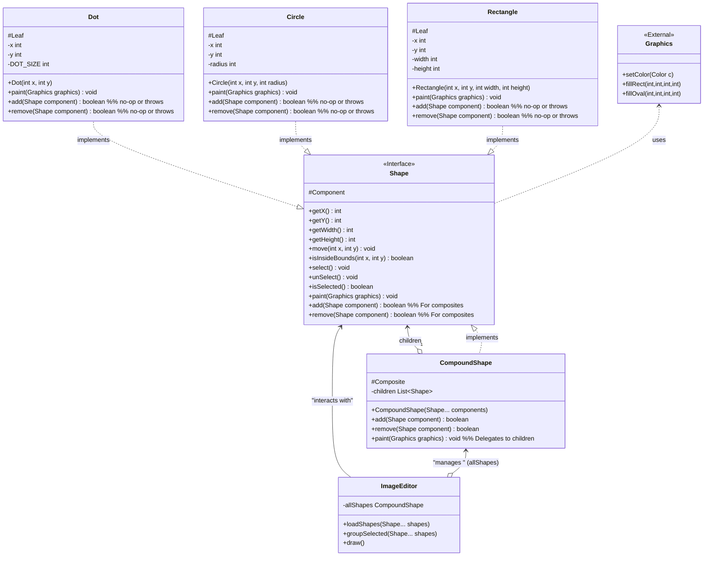

# Composite Pattern - Java Example

## 1. Introduction

This document analyzes the Java implementation of the Composite design pattern provided by Refactoring.Guru. The Composite pattern allows you to compose objects into tree structures to represent part-whole hierarchies. It lets clients treat individual objects (leaves) and compositions of objects (composites) uniformly through a shared interface.

The example demonstrates creating a simple graphics editor where individual shapes (Dot, Circle) and grouped shapes (CompoundShape) can be treated in the same way for operations like drawing, moving, and selecting.

## 2. Problem

Imagine developing a graphics application where you need to work with simple graphic primitives like dots and circles, as well as complex figures that are composed of several simpler ones (e.g., a drawing made of multiple shapes).

A naive approach might involve:
*   Separate classes for simple shapes (`Dot`, `Circle`) and grouped shapes (`GroupOfShapes`).
*   The client code (e.g., an `ImageEditor`) would need to constantly check the type of object it's dealing with:
    ```java
    // object could be a Dot, Circle, or GroupOfShapes
    if (object instanceof Dot) {
        ((Dot) object).drawSpecificDot();
    } else if (object instanceof Circle) {
        ((Circle) object).drawSpecificCircle();
    } else if (object instanceof GroupOfShapes) {
        for (Object child : ((GroupOfShapes) object).getChildren()) {
            // ... more instanceof checks ...
        }
    }
    ```

This approach has several drawbacks:
*   **Complex Client Code:** The client becomes cluttered with `if/else` or `switch` statements and `instanceof` checks to handle different types of objects.
*   **Difficult to Add New Types:** Adding a new shape type (e.g., `Rectangle`) requires modifying the client code in many places.
*   **Non-Uniform Treatment:** Simple and complex objects are treated differently, making the code harder to understand and maintain.
*   **Recursive Operations are Awkward:** Performing an operation on a group that needs to be propagated to all its children becomes cumbersome.

## 3. Solution: Composite

The Composite pattern solves this by creating a common interface for both simple (leaf) and complex (composite) objects:

1.  **Component Interface:** Defines the common interface for all objects in the composition, both leaves and composites. It declares operations applicable to all parts (e.g., `draw()`, `move()`, `select()`). It may also include methods for managing child components (e.g., `add()`, `remove()`, `getChild()`), though leaf objects might provide empty or exception-throwing implementations for these.
2.  **Leaf Classes:** Represent the primitive objects in the composition. A leaf implements the Component interface but has no children. It defines behavior for primitive objects. For child-management operations from the Component interface, leaves typically do nothing or throw an exception.
3.  **Composite Class:** Represents complex objects that can have children (which can be other leaves or composites). A composite implements the Component interface and stores a collection of child components. Operations defined in the Component interface are often delegated to its children. It implements the child-management methods.
4.  **Client:** The client code interacts with all objects in the composite structure through the Component interface. This means the client can treat individual leaf objects and composite objects uniformly, without needing to know their specific concrete class.

This structure allows for building complex tree-like structures where an operation performed on a composite object can be recursively propagated to all its children.

## 4. Code Analysis

### Components:

*   **Component Interface:**
    *   `shapes/Shape.java`: Interface defining common operations for all graphic objects, such as `getX()`, `getY()`, `getWidth()`, `getHeight()`, `move()`, `isSelected()`, `select()`, `unSelect()`, `paint()`. It also includes methods for composite structures like `isInsideBounds()`, `add()`, `remove()`, although leaf objects might not fully support `add`/`remove`.
*   **Leaf Classes:**
    *   `shapes/Dot.java`: Implements `Shape`. Represents a single dot. Provides concrete implementations for drawing and other operations. `add()` and `remove()` methods are typically empty or could throw `UnsupportedOperationException`.
    *   `shapes/Circle.java`: Implements `Shape`. Represents a circle. Provides concrete implementations. Similar to `Dot` regarding composite methods.
*   **Composite Class:**
    *   `shapes/CompoundShape.java`: Implements `Shape`. Represents a collection of other `Shape` objects (children). It maintains a list of children. Operations like `paint()` or `move()` are typically delegated to all children. It implements `add()` and `remove()` to manage its children.
*   **Client:**
    *   `ImageEditor.java`: Contains the logic for interacting with shapes. It holds a reference to a `CompoundShape` (which acts as the canvas or a selection group). It calls methods like `paint()` or `groupSelected()` on `Shape` objects without needing to know if they are simple or compound.
*   **Configuration/Setup:**
    *   `Demo.java`: The entry point. It creates an `ImageEditor` and populates it with various `Shape` objects (Dots, Circles, and CompoundShapes), then simulates user interactions or drawing.

## 5. Class Diagram (Mermaid)



## 6. How it Works (Interaction Flow)

1.  **Setup (`Demo.java`)**: The `Demo` class (or a similar setup mechanism) creates instances of leaf objects (`Dot`, `Circle`) and composite objects (`CompoundShape`).
2.  **Building the Tree (`Demo.java` / `ImageEditor.java`)**:
    *   Simple shapes are created.
    *   `CompoundShape` objects are created, and other `Shape` objects (which can be leaves or other composites) are added to them using the `add()` method. This forms a tree structure.
    *   The `ImageEditor` might load these shapes into a main `CompoundShape` representing the canvas or a selection.
3.  **Client Interaction (`ImageEditor.java`)**:
    *   The `ImageEditor` (client) wants to perform an operation, like `paint()`, on all shapes.
    *   It calls the `paint()` method on its top-level `CompoundShape` (e.g., `allShapes.paint(graphics)`).
4.  **Operation Execution**:
    *   If `paint()` is called on a `Leaf` object (e.g., `Dot`), the `Dot` itself performs the drawing operation.
    *   If `paint()` is called on a `Composite` object (e.g., `CompoundShape`), the `CompoundShape` typically iterates through its children (which are all `Shape` objects) and calls the `paint()` method on each child.
    *   This delegation continues recursively down the tree until all leaf nodes have performed their part of the operation.
5.  **Uniform Treatment**: The `ImageEditor` doesn't need to distinguish between a `Dot`, `Circle`, or `CompoundShape` when calling `paint()`, `move()`, `select()`, etc. It treats them all as `Shape` objects. For example, `imageEditor.groupSelected(shape1, dot2, compoundShape3)` can take any `Shape` objects and add them to a new `CompoundShape`.

## 7. Benefits

*   **Uniformity:** Clients can treat individual objects and compositions of objects uniformly through the component interface. This simplifies client code.
*   **Hierarchical Structures:** The pattern makes it easy to represent and work with part-whole hierarchies (tree structures).
*   **Simplified Client Code:** Reduces the need for `if/else` or `instanceof` checks in the client to differentiate between simple and complex objects.
*   **Extensibility:** Easy to add new types of `Leaf` and `Composite` components without changing the client code, as long as they implement the `Shape` interface.
*   **Recursive Operations:** Operations that need to be applied to an entire hierarchy (like draw all, move all, calculate total bounding box) become straightforward to implement in the composite.

## 8. Drawbacks

*   **"Fattest" Interface:** The Component interface might become "fat" if it tries to support too many operations, some of which might only make sense for `Composites` (e.g., `add()`, `remove()`) but not for `Leaves`. Leaves must then provide trivial or exception-throwing implementations for these methods.
*   **Type Safety vs. Transparency:**
    *   *Transparency*: If child management operations (`add`, `remove`, `getChild`) are in the Component interface, leaves must implement them (often as no-ops or throwing exceptions). This makes all components look the same (transparent) but sacrifices some type safety, as a client might try to add a child to a leaf.
    *   *Safety*: If child management operations are only in the Composite class, the client would need to check types (`instanceof`) before calling these methods. This is safer but loses some transparency. The Refactoring.Guru example opts for transparency by including `add`/`remove` in the `Shape` interface.
*   **Can Make the Design Overly General:** For some systems, the tree structure might be an over-engineering if the hierarchy is simple or fixed.

## 9. Conclusion

The Composite pattern, as demonstrated in the Refactoring.Guru graphics editor example, is a powerful tool for building systems that need to treat individual objects and groups of objects in a uniform manner. It excels at representing hierarchical structures and simplifying client code by providing a common interface. While it can lead to a more general component interface, the benefits of simplified client logic and easy extensibility often make it a valuable pattern for applications dealing with tree-like data structures.