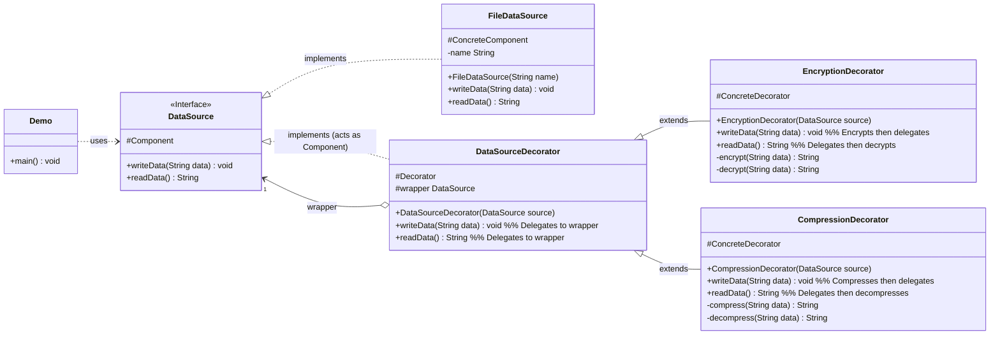

# Decorator Pattern - Java Example

## 1. Introduction

This document analyzes the Java implementation of the Decorator design pattern provided by Refactoring.Guru. The Decorator pattern allows behavior to be added to an individual object, either statically or dynamically, without affecting the behavior of other objects from the same class. It's a structural pattern that involves a set of decorator classes that are used to wrap concrete components.

The example demonstrates how to add functionalities like compression and encryption to a data source object dynamically.

## 2. Problem

Imagine you have a simple data reading/writing component (e.g., `FileDataSource`). Now, you need to add optional behaviors to it, such as:
*   Encrypting data before writing and decrypting after reading.
*   Compressing data before writing and decompressing after reading.
*   Possibly both encryption and compression.

Using inheritance to achieve this would lead to a class explosion:
*   `FileDataSource`
*   `EncryptedFileDataSource`
*   `CompressedFileDataSource`
*   `EncryptedAndCompressedFileDataSource`
*   `CompressedAndEncryptedFileDataSource` (order might matter)

This approach has several drawbacks:
*   **Class Proliferation:** The number of subclasses grows exponentially with the number of optional features.
*   **Inflexibility:** The combination of features is fixed at compile time. You can't easily add or remove features at runtime.
*   **Complexity:** Managing and understanding this large class hierarchy becomes difficult.
*   **Violation of Single Responsibility Principle:** A class like `EncryptedAndCompressedFileDataSource` handles multiple concerns.

## 3. Solution: Decorator

The Decorator pattern solves this by wrapping the original object with one or more "decorator" objects. Each decorator adds a specific piece of functionality.

1.  **Component Interface:** Defines the common interface for both the objects being decorated (wrappers) and the decorators themselves. This allows decorators to be used interchangeably with the original component.
2.  **Concrete Component Class:** The original class that implements the Component interface. This is the object we want to add new behavior to (e.g., `FileDataSource`).
3.  **Abstract Decorator Class:** Implements the Component interface and holds a reference to a Component object (the "wrapper"). It typically delegates all calls to the wrapper. This class serves as the base for concrete decorators.
4.  **Concrete Decorator Classes:** Extend the Abstract Decorator. They add their specific behavior either before or after delegating the call to the wrapper object. Multiple decorators can be stacked on top of each other.
5.  **Client:** The client code works with objects through the Component interface. It can wrap a Concrete Component with any number of Concrete Decorators, or use the Concrete Component directly. The client doesn't usually know the specific concrete decorators it's interacting with, only that they conform to the Component interface.

This approach allows for a flexible way to add responsibilities to objects by "decorating" them at runtime.

## 4. Code Analysis

### Components:

*   **Component Interface:**
    *   `DataSource.java`: Interface defining operations for reading and writing data (`writeData(String data)`, `readData()`).
*   **Concrete Component:**
    *   `FileDataSource.java`: Implements `DataSource`. Provides basic functionality of writing data to a file and reading data from a file. This is the core object that will be decorated.
*   **Abstract Decorator:**
    *   `DataSourceDecorator.java`: Implements `DataSource`. It holds a reference to another `DataSource` object (the `wrapper`). Its `writeData()` and `readData()` methods delegate the calls to the `wrapper`. This class is the base for all concrete decorators.
*   **Concrete Decorators:**
    *   `EncryptionDecorator.java`: Extends `DataSourceDecorator`.
        *   `writeData(String data)`: Encrypts the data *before* calling `super.writeData(encryptedData)` (which delegates to the wrapper).
        *   `readData()`: Calls `super.readData()` (which delegates to the wrapper) to get the (potentially encrypted) data, then decrypts it *before* returning.
    *   `CompressionDecorator.java`: Extends `DataSourceDecorator`.
        *   `writeData(String data)`: Compresses the data *before* calling `super.writeData(compressedData)`.
        *   `readData()`: Calls `super.readData()` to get the (potentially compressed) data, then decompresses it *before* returning.
*   **Client:**
    *   `Demo.java`: The entry point.
        1.  It creates a simple `FileDataSource`.
        2.  It then "decorates" this source: first with `CompressionDecorator`, then with `EncryptionDecorator`. The order of decoration matters (e.g., compress then encrypt, or encrypt then compress).
        3.  It writes data using the outermost decorator. The data flows through the decorators (encryption, then compression) and finally to the `FileDataSource`.
        4.  It reads data using the outermost decorator. The data flows from `FileDataSource`, then through the decorators in reverse order (decompression, then decryption).
        5.  The `Demo` class primarily interacts with the `DataSource` interface, regardless of how many decorators are applied.

## 5. Class Diagram (Mermaid)

## 6. How it Works (Interaction Flow)

1.  **Component Instantiation (`Demo.java`)**: The client creates an instance of a `ConcreteComponent` (e.g., `FileDataSource source = new FileDataSource("somefile.dat");`).
2.  **Decoration (`Demo.java`)**:
    *   The client "wraps" the `ConcreteComponent` with one or more `ConcreteDecorator` instances.
    *   Example: `source = new CompressionDecorator(source);`
    *   Then: `source = new EncryptionDecorator(source);`
    *   Now, `source` refers to the outermost `EncryptionDecorator`, which wraps `CompressionDecorator`, which in turn wraps `FileDataSource`.
3.  **Client Operation Call (`Demo.java`)**: The client calls an operation (e.g., `source.writeData("Test data");`) on the outermost decorator.
4.  **Decorator Behavior and Delegation (Write Operation Example)**:
    *   `EncryptionDecorator.writeData()` is called. It first encrypts the input data. Then, it calls `super.writeData()` (which is `DataSourceDecorator.writeData()`) with the encrypted data.
    *   `DataSourceDecorator.writeData()` (in `EncryptionDecorator`'s context) delegates the call to its `wrapper.writeData()`, which is the `CompressionDecorator` instance.
    *   `CompressionDecorator.writeData()` is called with the encrypted data. It compresses this data. Then, it calls `super.writeData()` with the encrypted-then-compressed data.
    *   `DataSourceDecorator.writeData()` (in `CompressionDecorator`'s context) delegates to its `wrapper.writeData()`, which is the `FileDataSource` instance.
    *   `FileDataSource.writeData()` is called with the encrypted-then-compressed data and writes it to the file.
5.  **Decorator Behavior and Delegation (Read Operation Example)**:
    *   Client calls `source.readData()`.
    *   `EncryptionDecorator.readData()` calls `super.readData()` (delegating to `wrapper.readData()`).
    *   `CompressionDecorator.readData()` calls `super.readData()` (delegating to `wrapper.readData()`).
    *   `FileDataSource.readData()` reads the raw (encrypted-then-compressed) data from the file and returns it.
    *   `CompressionDecorator.readData()` receives this data, decompresses it, and returns the (now only encrypted) data.
    *   `EncryptionDecorator.readData()` receives the encrypted data, decrypts it, and returns the original plain data to the client.
6.  **Transparency**: The client interacts with the decorated object through the common `DataSource` interface, unaware of the specific decorators applied or their order, only that the expected operations are performed.

## 7. Benefits

*   **Flexibility:** Responsibilities can be added to and removed from objects dynamically at runtime by adding or removing decorators.
*   **Avoids Subclass Explosion:** Prevents a large number of subclasses for every possible combination of features.
*   **Single Responsibility Principle:** Each decorator class has a specific, well-defined responsibility (e.g., encryption, compression).
*   **Open/Closed Principle:** New functionalities (decorators) can be added without modifying existing component or decorator classes.
*   **Composition over Inheritance:** Favors a more flexible way to extend functionality.
*   **Mix and Match Features:** Different decorators can be combined in various ways.

## 8. Drawbacks

*   **Many Small Objects:** Can lead to a system with a lot of small objects, which might be hard to manage or understand if overused.
*   **Complexity in Decorator Identity:** A decorated component is not identical to the original component (in terms of `instanceof` checks against the concrete component class, though it is identical in terms of the component interface). Code relying on specific object types can be problematic.
*   **Order of Decoration Matters:** The order in which decorators are applied can be significant (e.g., encrypt then compress vs. compress then encrypt yields different results).
*   **Interface Bloat if Decorators Add New Methods:** If decorators add new public methods not present in the Component interface, clients need to be aware of the specific decorator types to use those methods, reducing transparency. (The Refactoring.Guru example avoids this by having decorators only override Component interface methods).

## 9. Conclusion

The Decorator pattern provides an elegant and flexible solution for adding responsibilities to objects dynamically. It's particularly useful when you have a set of optional features that can be combined in various ways, avoiding the rigidity and complexity of a large inheritance hierarchy. While it can introduce a number of small objects, its benefits in terms of flexibility and adherence to design principles like SRP and OCP often make it a preferred choice for extensible object design.