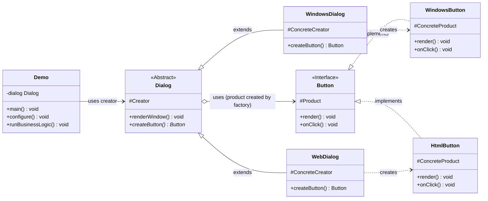

# Factory Pattern - Java Example

## 1. Introduction

This document analyzes the Java implementation of the Factory design pattern provided by Refactoring.Guru. The Factory pattern defines an interface for creating an object, but lets subclasses alter the type of objects that will be created. It's a creational pattern that allows a class to defer instantiation to its subclasses, promoting loose coupling and flexibility.

The example demonstrates creating different types of dialog windows (Windows, Web) which, in turn, use different types of buttons appropriate for their respective UI environments.

## 2. Problem

Consider an application that needs to display different styles of dialog boxes depending on the context (e.g., a desktop application vs. a web application). Each dialog box might contain common elements like buttons, but these buttons also need to match the style of their parent dialog.

If a base `Dialog` class directly instantiates a specific button type (e.g., `new WindowsButton()`), creating a new dialog style (e.g., `WebDialog`) that requires a different button (e.g., `HtmlButton`) would force modification of the base `Dialog` class or lead to complex conditional logic.

This approach has several drawbacks:
*   **Tight Coupling:** The `Dialog` class becomes tightly coupled to concrete button classes.
*   **Violation of Open/Closed Principle:** Adding new dialog types and their corresponding buttons requires changing existing code.
*   **Reduced Flexibility:** It's hard to vary the product (button) independently of the creator (dialog).

## 3. Solution: Factory

The Factory pattern addresses this by delegating the responsibility of object instantiation to subclasses:

1.  **Product Interface:** Defines the interface for the objects that the factory will create (e.g., `Button`). This interface declares common operations the products must perform (e.g., `render()`, `onClick()`).
2.  **Concrete Product Classes:** Implement the Product interface for each specific variant (e.g., `WindowsButton`, `HtmlButton`). Each concrete product provides the specific implementation for its variant.
3.  **Creator Class (Abstract Creator):** Declares the factory, which returns an object of the Product type (e.g., an abstract `Dialog` class with an abstract `createButton()` method). The Creator class often contains some core business logic that uses the product objects returned by the factory (e.g., a `renderWindow()` method in `Dialog` that uses the button).
4.  **Concrete Creator Classes:** Subclass the Creator and override the factory to return an instance of a specific Concrete Product (e.g., `WindowsDialog` overrides `createButton()` to return a `WindowsButton`, `WebDialog` overrides it to return an `HtmlButton`).
5.  **Client:** The client code interacts with an instance of a Concrete Creator through the Creator's interface. When the client calls a method on the creator that requires a product, the creator uses its factory to produce that product. The client doesn't need to know which concrete product is being created.

## 4. Code Analysis

### Components:

*   **Product Interface:**
    *   `buttons/Button.java`: Interface defining `render()` and `onClick()` methods for all buttons.
*   **Concrete Products:**
    *   `buttons/WindowsButton.java`: Implements `Button` for a native Windows look and feel.
    *   `buttons/HtmlButton.java`: Implements `Button` for an HTML/web look and feel.
*   **Creator (Abstract Class):**
    *   `factory/Dialog.java`: An abstract class. It defines the abstract factory `createButton()` which returns a `Button`. It also contains business logic (e.g., `renderWindow()`) that uses the button created by the factory.
*   **Concrete Creators:**
    *   `factory/WindowsDialog.java`: Extends `Dialog`. Implements `createButton()` to instantiate and return a `WindowsButton`.
    *   `factory/WebDialog.java`: Extends `Dialog`. Implements `createButton()` to instantiate and return an `HtmlButton`.
*   **Client / Configuration:**
    *   `Demo.java`: The entry point. It determines which type of dialog is needed (simulated via a configuration setting), instantiates the corresponding concrete `Dialog` subclass, and then calls methods on it (e.g., `renderWindow()`) which internally use the factory.

## 5. Class Diagram (Mermaid)

## 6. How it Works (Interaction Flow)

1.  **Configuration (`Demo.java`)**: The `Demo` class reads a configuration (e.g., simulating checking an environment variable or config file) to determine which dialog type is needed (e.g., "Windows" or "Web").
2.  **Creator Instantiation (`Demo.java`)**: Based on the configuration, `Demo` instantiates a *concrete creator* object (e.g., `new WindowsDialog()` or `new WebDialog()`) and stores it, typically typed as the abstract `Dialog`.
3.  **Client Logic Execution (`Demo.java` calls `Dialog` method)**: The `Demo` class calls a method on the `Dialog` instance that requires a product. In the example, `Demo` might call `dialog.renderWindow()`.
4.  **Factory Invocation (within `Dialog.renderWindow()`):** The `renderWindow()` method (or similar business logic method) within the `Dialog` class needs a button. It calls its own `createButton()` factory. This call is polymorphic.
5.  **Concrete Product Instantiation (by Concrete Creator):** Because the `dialog` object is actually an instance of a *concrete creator* (`WindowsDialog` or `WebDialog`), the overridden version of `createButton()` in that concrete creator class is executed.
    *   If `dialog` is `WindowsDialog`, `WindowsDialog.createButton()` is called, which returns a new `WindowsButton`.
    *   If `dialog` is `WebDialog`, `WebDialog.createButton()` is called, which returns a new `HtmlButton`.
6.  **Product Usage (within `Dialog.renderWindow()`):** The `renderWindow()` method in the `Dialog` class receives the `Button` object (which is actually a `WindowsButton` or `HtmlButton`). It then uses this button (e.g., `button.render()`, `button.onClick()`) as part of its rendering logic, without needing to know the button's concrete type.

## 7. Benefits

*   **Avoids Tight Coupling:** The creator class (`Dialog`) is decoupled from concrete product classes (`WindowsButton`, `HtmlButton`). It only works with the `Button` interface.
*   **Subclass Control Over Instantiation:** Subclasses (`WindowsDialog`, `WebDialog`) have full control over which concrete product to create.
*   **Single Responsibility Principle:** Product creation logic is encapsulated within specific concrete creator subclasses. The main business logic in the superclass creator remains focused on its primary tasks, using the product interface.
*   **Open/Closed Principle:** You can introduce new types of products (and their corresponding creators) without modifying the existing client code or the abstract creator, as long as they adhere to the established interfaces. For example, adding a `MacOSDialog` and `MacOSButton` requires new classes but no changes to `Dialog` or `Demo` (if `Demo` is configured to use the new dialog).
*   **Flexibility in Product Variation:** Provides a hook for subclasses to provide an extended version of a product.

## 8. Drawbacks

*   **Increased Class Hierarchy:** The pattern can lead to a parallel hierarchy of classes, as each concrete creator typically corresponds to a specific concrete product. This can increase the number of classes in the system.
*   **Boilerplate for Simple Cases:** If the creation logic is very simple or if there are only a few product types that rarely change, the pattern might introduce unnecessary complexity.

## 9. Conclusion

The Factory pattern, as illustrated in the Refactoring.Guru example, is a powerful creational pattern for scenarios where a class cannot anticipate the type of objects it needs to create beforehand or when it wants to delegate the responsibility of instantiation to its subclasses. It enhances code flexibility and maintainability by decoupling product creation from the client and the core logic of the creator, making it easier to extend the system with new product types. While it can increase the number of classes, the benefits in terms of design flexibility and adherence to SOLID principles often justify its use.