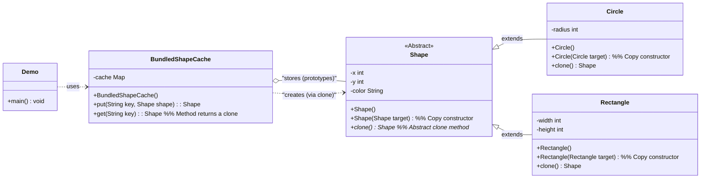

# Prototype Pattern - Java Example

## 1. Introduction

This document analyzes the Java implementation of the Prototype design pattern provided by Refactoring.Guru. The Prototype pattern is a creational design pattern that lets you create new objects by copying an existing object, known as a prototype, rather than creating objects from scratch using a constructor. This is particularly useful when the cost of creating an object is more expensive or complex than copying an existing one.

The example demonstrates creating various `Shape` objects (like `Circle`, `Rectangle`) by cloning pre-configured prototype instances stored in a cache.

## 2. Problem

Imagine you need to create many instances of objects that are very similar or have a complex and costly initialization process. For example, loading configuration from a file, making network requests, or performing extensive computations to set up an object's initial state.

Consider these scenarios:
*   **Expensive Initialization:** If creating an object (`new MyComplexObject()`) involves significant overhead, instantiating many such objects becomes inefficient.
*   **Numerous Variations:** You might have many variations of an object (e.g., different shapes with specific colors, positions, and sizes) that are largely similar. Re-creating each from scratch with all its specific parameters can be verbose.
*   **Dynamic Configuration:** Sometimes, the exact type of object to create is determined at runtime, and you want to avoid a complex series of `if/else` or `switch` statements to instantiate the correct class.

A naive approach of always using constructors for new objects can lead to:
*   **Performance Issues:** Repeatedly incurring high initialization costs.
*   **Code Duplication:** If similar objects are created, the setup logic might be duplicated.
*   **Tight Coupling:** The client code becomes tightly coupled to the concrete classes it needs to instantiate.

## 3. Solution: Prototype

The Prototype pattern solves this by creating new objects through cloning existing "prototype" instances:

1.  **Prototype Interface (or Abstract Class):** Declares a cloning method (e.g., `clone()`). All objects that can be used as prototypes must implement this interface.
2.  **Concrete Prototype Classes:** Implement the Prototype interface. Each concrete prototype is responsible for creating a copy of itself. The cloning can be either a shallow copy or a deep copy, depending on the requirements.
3.  **Client:** Instead of instantiating objects directly using `new`, the client asks a prototype object to clone itself.
4.  **(Optional) Prototype Registry/Cache:** A mechanism to store and manage pre-configured prototype instances. The client can request a clone of a prototype from the registry, often using a key or identifier. This decouples the client from knowing the concrete prototype classes directly.

When a new object is needed, the client finds a suitable prototype and calls its `clone()` method. The prototype returns a new object that is a copy of itself.

## 4. Code Analysis

### Components:

*   **Prototype (Abstract Class in this example):**
    *   `shapes/Shape.java`: An abstract class that defines common properties (like `x`, `y`, `color`) and an abstract `clone()` method. All concrete shapes that can be cloned must extend this class and implement `clone()`.
*   **Concrete Prototypes:**
    *   `shapes/Circle.java`: Extends `Shape`. Implements the `clone()` method to create a new `Circle` object by copying the properties from the current `Circle` instance. It uses its own constructor in the `clone` method for a clean copy.
    *   `shapes/Rectangle.java`: Extends `Shape`. Implements the `clone()` method similarly to `Circle`, creating a new `Rectangle` by copying properties.
*   **Prototype Registry/Cache:**
    *   `cache/BundledShapeCache.java`: A class that pre-initializes and stores prototype `Shape` objects (a `Circle` and a `Rectangle`) in a `HashMap`.
        *   The constructor of `BundledShapeCache` creates instances of `Circle` and `Rectangle`, configures them (sets color, dimensions, etc.), and stores them in the `cache` map using string keys ("Big green circle", "Medium blue rectangle").
        *   It provides a `put(String key, Shape shape)` method to add new prototypes to the cache.
        *   It provides a `get(String key)` method that retrieves a prototype by its key and returns a *clone* of that prototype by calling its `clone()` method.
*   **Client:**
    *   `Demo.java`: The entry point.
        1.  It creates an instance of `BundledShapeCache`.
        2.  It then requests shapes from the cache using keys (e.g., `cache.get("Big green circle")`).
        3.  The cache returns *clones* of the stored prototypes.
        4.  The `Demo` can then use these cloned shapes, potentially modifying them further without affecting the original prototypes in the cache. It also demonstrates that modifying a clone does not affect other clones or the original prototype.

## 5. Class Diagram (Mermaid)

## 6. How it Works (Interaction Flow)

1.  **Initialization & Prototyping (`BundledShapeCache` constructor in `Demo.java`)**:
    *   Instances of `ConcretePrototype` classes (`Circle`, `Rectangle`) are created.
    *   These instances are configured with specific initial states (e.g., `bigGreenCircle.color = "Green"`, `mediumBlueRectangle.width = 20`).
    *   These configured objects (prototypes) are stored in the `BundledShapeCache` (the registry) with unique keys.
2.  **Client Request (`Demo.java`)**:
    *   The client (`Demo`) needs a new shape object. Instead of using `new Circle()` or `new Rectangle()`, it requests an object from the `BundledShapeCache` by its key: `Shape shape1 = cache.get("Big green circle");`.
3.  **Retrieval and Cloning (`BundledShapeCache.get()`)**:
    *   The `BundledShapeCache` retrieves the prototype `Shape` object associated with the given key from its internal `HashMap`.
    *   It then calls the `clone()` method on this retrieved prototype: `return cache.get(key).clone();`.
4.  **Concrete Prototype Cloning (`Circle.clone()` or `Rectangle.clone()`)**:
    *   The `clone()` method in the concrete prototype (e.g., `Circle`) creates a new instance of itself.
    *   It copies the state (attributes like `x`, `y`, `color`, `radius`) from the prototype instance to the new instance. In this example, this is typically done by calling a copy constructor: `new Circle(this)`.
5.  **Return Cloned Object**:
    *   The newly created and initialized clone is returned by `BundledShapeCache.get()` to the client (`Demo`).
    *   The client now has a new `Shape` object that is a copy of the requested prototype. It can be used independently and modified without affecting the original prototype stored in the cache or other clones. For instance, `clonedShape.x = 10;` will not change `originalPrototype.x`.

## 7. Benefits

*   **Reduces Subclassing:** Avoids the need for a complex hierarchy of creator classes (as seen in Abstract Factory or Factory Method).
*   **Hides Concrete Classes from Client:** The client can work with objects through the prototype interface without knowing their concrete types, especially when using a registry.
*   **Performance Improvement:** Cloning can be faster than creating objects from scratch if the initialization process is complex or resource-intensive. Once a prototype is built, subsequent objects are created by copying.
*   **Dynamic Configuration:** New concrete prototypes can be added to a registry at runtime.
*   **Convenience:** Easily create objects with pre-set configurations.

## 8. Drawbacks

*   **Complexity of Cloning:** Cloning complex objects with circular references or many nested objects can be difficult. One must decide between shallow and deep copy.
    *   **Shallow Copy:** Copies only the top-level object, and references to other objects are shared. Modifying a referenced object in a clone can affect the original prototype if not handled carefully.
    *   **Deep Copy:** Copies the object and all objects it references recursively. This ensures full independence but can be more complex and slower to implement. (The Refactoring.Guru example uses copy constructors which generally facilitate a deep copy of primitive and String fields, but care is needed for mutable object fields).
*   **Implementation Overhead:** Every concrete prototype class must implement the `clone()` method. If using Java's built-in `Cloneable` interface and `Object.clone()`, there are specific rules and potential pitfalls (e.g., `CloneNotSupportedException`, default shallow copy). The example avoids `Cloneable` and uses explicit copy constructors in `clone()` methods, which is often a cleaner approach in Java.
*   **Configuration of Clones:** While the prototype provides an initial state, clones might still need further configuration after creation, which can sometimes negate the simplicity.

## 9. Conclusion

The Prototype pattern offers an effective way to create objects by copying existing instances. It is particularly advantageous when object creation is costly, when there are many similar objects with slight variations, or when the system needs to be flexible in how objects are created and configured. By using a registry of prototypes, it also allows for decoupling the client from concrete class instantiations. Careful consideration of shallow versus deep copying is crucial when implementing the `clone` operation for complex objects.