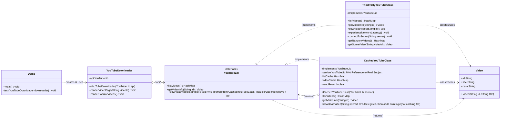

# Proxy Pattern - Java Example

## 1. Introduction

This document analyzes the Java implementation of the Proxy design pattern provided by Refactoring.Guru. The Proxy pattern provides a surrogate or placeholder for another object (the "real subject") to control access to it. This control can be for various reasons, such as lazy initialization (virtual proxy), access control (protection proxy), logging requests (logging proxy), or caching results (caching proxy). It's a structural pattern that allows the proxy to be used in place of the real object.

The example demonstrates a caching proxy for a YouTube video library. The proxy caches requests to a third-party YouTube API to reduce the number of actual API calls and speed up subsequent requests for the same data.

## 2. Problem

Imagine you have an object that is resource-intensive to instantiate or access. This could be:
*   A large object that consumes a lot of memory and is not always needed (leading to lazy initialization needs).
*   An object representing a remote service (like a web service or API) where network calls are slow and costly.
*   An object whose access needs to be controlled or logged.

Directly using such an object everywhere it's needed can lead to:
*   **Performance Issues:** Slow startup if objects are initialized eagerly, or slow responses if remote calls are made frequently for the same data.
*   **High Resource Consumption:** Unnecessary use of memory or network bandwidth.
*   **Lack of Control:** Difficulty in adding functionalities like access checks, logging, or caching without modifying the original object's code, which might violate the Single Responsibility Principle or be impossible if it's a third-party library.

In the context of the Refactoring.Guru example, directly calling a third-party YouTube API for video information for every request would be inefficient, especially if the same video information is requested multiple times. It would lead to repeated network latency and potentially hitting API rate limits.

## 3. Solution: Proxy

The Proxy pattern introduces a proxy object that has the same interface as the real service object. The client interacts with the proxy, unaware that it's not the real service. The proxy then manages access to the real service.

1.  **Service Interface:** Defines the common interface for both the Real Subject and the Proxy. This ensures that the client can treat the proxy just like the real subject.
2.  **Real Subject (or Service):** The actual object that the proxy represents. It contains the core business logic. The proxy will delegate requests to the real subject when necessary.
3.  **Proxy:**
    *   Implements the Service Interface.
    *   Holds a reference to an instance of the Real Subject. It may be responsible for creating and managing the lifecycle of the Real Subject instance (e.g., for lazy initialization).
    *   Manages access to the Real Subject. It can perform additional operations before or after delegating a request to the Real Subject (e.g., check cache, log request, control access, lazy load).
4.  **Client:** Interacts with objects through the Service Interface. The client is typically unaware whether it's working with a Proxy or a Real Subject directly.

In the YouTube example, the `CachedYouTubeClass` (Proxy) will first check its cache if video information is requested. If found, it returns the cached data. If not, it calls the `ThirdPartyYouTubeClass` (Real Subject) to fetch the data, caches it, and then returns it.

## 4. Code Analysis

### Components:

*   **Service Interface:**
    *   `some_cool_media_library/YouTubeLib.java`: Interface defining operations to interact with a YouTube service, such as `listVideos()` and `getVideoInfo(String id)`.
*   **Real Subject (Service):**
    *   `some_cool_media_library/ThirdPartyYouTubeClass.java`: Implements `YouTubeLib`. This class simulates interaction with a real, slow, third-party YouTube API. It includes artificial delays (`experienceNetworkLatency()`) to mimic network calls for fetching video lists and individual video metadata.
*   **Proxy:**
    *   `proxy/CachedYouTubeClass.java`: Implements `YouTubeLib`.
        *   It holds a reference to an instance of the real service (`YouTubeLib service`).
        *   It maintains internal caches for the list of videos (`listCache`) and individual video information (`videoCache`).
        *   `listVideos()`: Checks if `listCache` is empty. If so, it calls `service.listVideos()` (delegating to `ThirdPartyYouTubeClass`), stores the result in `listCache`, and then returns it. Otherwise, it returns the cached list directly.
        *   `getVideoInfo(String id)`: Checks if `videoCache` contains information for the given `id`. If so, it returns the cached `Video` object. Otherwise, it calls `service.getVideoInfo(id)`, stores the result in `videoCache`, and then returns it.
        *   It also simulates a download operation `downloadVideo(String id)` which simply checks if the video exists and prints a message, without actually downloading or caching the video file itself (the caching is for metadata).
*   **Client:**
    *   `downloader/YouTubeDownloader.java`: A class that uses a `YouTubeLib` object to render video pages and react to user input (simulated). It doesn't know whether it's working with the real `ThirdPartyYouTubeClass` or the `CachedYouTubeClass` proxy; it just uses the `YouTubeLib` interface.
*   **Configuration/Setup:**
    *   `Demo.java`: The entry point.
        1.  It demonstrates usage with the direct `ThirdPartyYouTubeClass` to show the initial latency.
        2.  It then demonstrates usage with the `CachedYouTubeClass` (which internally uses `ThirdPartyYouTubeClass`).
        3.  It calls methods like `renderVideoPage()` and `renderPopularVideos()` on the `YouTubeDownloader`, which in turn calls `listVideos()` and `getVideoInfo()` on the provided `YouTubeLib` implementation. The first calls via the proxy will be slow (as they hit the real service), but subsequent identical calls will be fast due to caching.

## 5. Class Diagram (Mermaid)

## 6. How it Works (Interaction Flow)

1.  **Client Instantiation (`Demo.java`)**:
    *   The `Demo` creates an instance of the `RealSubject` (`ThirdPartyYouTubeClass`).
    *   Then, it creates an instance of the `Proxy` (`CachedYouTubeClass`), passing the `RealSubject` instance to its constructor.
    *   Finally, it creates a `YouTubeDownloader` (Client) and injects the `Proxy` instance (typed as `YouTubeLib`) into it.
    *   `YouTubeLib naiveDownloaderAPI = new ThirdPartyYouTubeClass();`
    *   `YouTubeLib smartDownloaderAPI = new CachedYouTubeClass(naiveDownloaderAPI);`
    *   `YouTubeDownloader naiveDownloader = new YouTubeDownloader(naiveDownloaderAPI);`
    *   `YouTubeDownloader smartDownloader = new YouTubeDownloader(smartDownloaderAPI);`
2.  **Client Request (`YouTubeDownloader.renderPopularVideos()`)**:
    *   The `YouTubeDownloader` calls `api.listVideos()` on the `YouTubeLib` instance it holds (which is the `CachedYouTubeClass` proxy).
3.  **Proxy Handles Request (`CachedYouTubeClass.listVideos()`)**:
    *   **Cache Check:** The `CachedYouTubeClass` first checks its `listCache`.
    *   **Cache Miss (First Call):** If the cache is empty (or `needReset` is true), the proxy calls `service.listVideos()` (delegating to the wrapped `ThirdPartyYouTubeClass`).
        *   **Real Subject Execution:** `ThirdPartyYouTubeClass.listVideos()` simulates a slow network call, fetches the video list, and returns it.
        *   **Proxy Caches Result:** The `CachedYouTubeClass` receives the list from the `ThirdPartyYouTubeClass` and stores it in its `listCache`.
    *   **Cache Hit (Subsequent Calls):** If `listCache` already contains the data, the proxy immediately returns the cached list without contacting the `ThirdPartyYouTubeClass`.
    *   The proxy returns the video list (either fresh or cached) to the `YouTubeDownloader`.
4.  **Similar flow for `getVideoInfo(String id)`**:
    *   `YouTubeDownloader` calls `api.getVideoInfo(videoId)`.
    *   `CachedYouTubeClass.getVideoInfo()` checks its `videoCache` for the specific `videoId`.
    *   On cache miss, it delegates to `service.getVideoInfo(videoId)`, caches the result, and then returns it.
    *   On cache hit, it returns the cached `Video` object.
5.  **Transparency:** The `YouTubeDownloader` client remains unaware of whether it's interacting directly with the `ThirdPartyYouTubeClass` or the `CachedYouTubeClass` proxy. It only knows about the `YouTubeLib` interface. The performance difference between the first and subsequent calls for the same data when using the proxy demonstrates the caching benefit.

## 7. Benefits

*   **Controlled Access:** The proxy can control access to the real subject, performing operations before or after the request is forwarded (e.g., caching, lazy loading, security checks, logging).
*   **Lazy Initialization (Virtual Proxy):** The real subject can be created only when it's actually needed, saving resources if it's expensive to instantiate and not always used.
*   **Reduced Network Load/Improved Performance (Caching Proxy):** As seen in the example, caching results of expensive operations (like API calls) can significantly improve performance for repeated requests.
*   **Remote Proxy:** Can represent an object located in a different address space, hiding the complexity of network communication.
*   **Protection Proxy:** Can control access rights to the real subject, allowing different clients to have different permissions.
*   **Single Responsibility Principle:** The proxy handles auxiliary concerns (like caching or access control) separate from the core business logic of the real subject.

## 8. Drawbacks

*   **Increased Complexity:** Introduces an additional layer of indirection and new classes, which can make the system more complex.
*   **Response Time Indirection:** The proxy adds a level of indirection, which might introduce a small performance overhead for requests that are not benefiting from a specific proxy feature (e.g., a request that always results in a cache miss and then hits the real service will be slightly slower than hitting the real service directly).
*   **Potential for "Fat" Proxy:** If a proxy tries to handle too many responsibilities (e.g., caching, logging, access control all in one proxy), it can become complex itself.

## 9. Conclusion

The Proxy pattern is a versatile pattern for controlling access to an object. It allows for the addition of behaviors like caching, lazy initialization, or security checks without modifying the client or the real subject's code. The caching proxy demonstrated effectively reduces network latency and API calls for repeated data requests, leading to a more responsive and efficient application. While it adds a layer of indirection, the benefits in terms of performance, resource management, and separation of concerns often make it a valuable design choice.